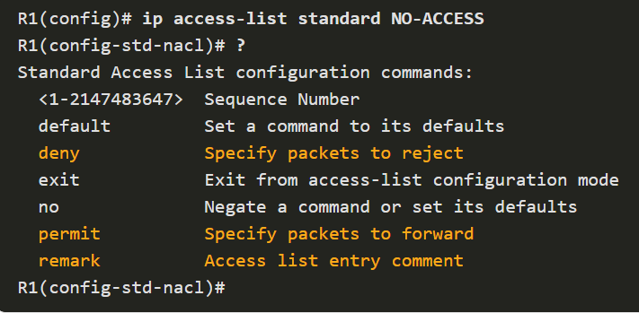
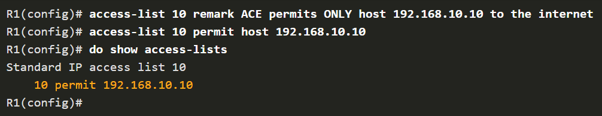
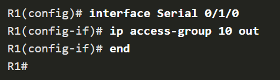

# STANDARD ACL

`(closest to destination)`

## Numbered ACL ( 1 - 99 | 1300 - 1999 )

```
access-list 10 {deny | permit | remark text} source [source-wildcard] [log]
```

## Named ACL

```
ip access-list standard 'access-list-name'
```



## Apply a Standard ACL to an Interface

```
interface f0/0
ip access-group {access-list-number | access-list-name} {in | out}
```

### SAMPLE - Create ACL



### SAMPLE - Apply ACL to Serial 0/1/0


\*\* _Remarks only show in the running config and not displayed here_

### SAMPLE - Create NAMED ACL

```
R1(config)# ip access-list standard PERMIT-ACCESS
R1(config-std-nacl)# remark ACE permits host 192.168.10.10
R1(config-std-nacl)# permit host 192.168.10.10
R1(config-std-nacl)# remark ACE permits all hosts in LAN 2
R1(config-std-nacl)# permit 192.168.20.0 0.0.0.255
R1(config-std-nacl)# exit
R1(config)#
```

### SAMPLE - Apply ACL to Serial 0/1/0

```
R1(config)# interface Serial 0/1/0
R1(config-if)# ip access-group PERMIT-ACCESS out
R1(config-if)# end
R1#
```

## Access-Class Command

```
R1(config-line)# access-class {access-list-number | access-list-name} { in | out }
```

<br/><br/><br/>

# EXTENDED ACL

`(closest to source)`

## Numbered EXT ACL ( 100 - 199 | 2000 - 2699 )

```
Router(config)# access-list access-list-number {deny | permit | remark text} protocol source source-wildcard [operator {port}] destination destination-wildcard [operator {port}] [established] [log]
```

## Apply an EXT ACL to an interface

```
Router(config-if)# ip access-group {access-list-number | access-list-name} {in | out}
```

`SAMPLE - Create NUMBERED EXT ACL`

```
R1(config)# access-list 110 permit tcp 192.168.10.0 0.0.0.255 any eq www
R1(config)# access-list 110 permit tcp 192.168.10.0 0.0.0.255 any eq 443
R1(config)# interface g0/0/0
R1(config-if)# ip access-group 110 in
R1(config-if)# exit
R1(config)#
```

## Named EXT ACL

```
R1(config)# ip access-list extended NO-FTP-ACCESS
R1(config-ext-nacl)#
```

`SAMPLE - Create NAMED EXT ACL`

```
R1(config)# ip access-list extended SURFING
R1(config-ext-nacl)# Remark Permits inside HTTP and HTTPS traffic
R1(config-ext-nacl)# permit tcp 192.168.10.0 0.0.0.255 any eq 80
R1(config-ext-nacl)# permit tcp 192.168.10.0 0.0.0.255 any eq 443
R1(config-ext-nacl)# exit
R1(config)#
R1(config)# ip access-list extended BROWSING
R1(config-ext-nacl)# Remark Only permit returning HTTP and HTTPS traffic
R1(config-ext-nacl)# permit tcp any 192.168.10.0 0.0.0.255 established
R1(config-ext-nacl)# exit
R1(config)# interface g0/0/0
R1(config-if)# ip access-group SURFING in
R1(config-if)# ip access-group BROWSING out
R1(config-if)# end
R1# show access-lists
Extended IP access list SURFING
    10 permit tcp 192.168.10.0 0.0.0.255 any eq www
    20 permit tcp 192.168.10.0 0.0.0.255 any eq 443 (124 matches)
Extended IP access list BROWSING
    10 permit tcp any 192.168.10.0 0.0.0.255 established (369 matches)
R1#
```
